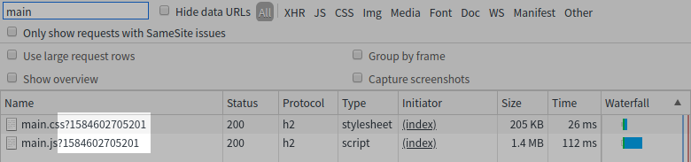

# metabill

[](https://clojars.org/jp.xcoo/metabill)

[](https://clojars.org/jp.xcoo/lein-metabill)

A tiny library to handle build meta informatoin.

## Prepare

Put `[jp.xcoo/metabill "0.1.0"]` into the `:dependencies` and `[jp.xcoo/lein-metabill "0.1.0"]` into the `:plugins` of your `project.clj`.
And run `lein metabill` before building for production.
It automatically generates `target/metabill.edn` which has some meta data of the build.

## Usage

### Avoid browser's caching

You can prevent browsers from caching old JS and CSS files using `with-build-time`:

```clojure
(ns hello-world.view
  (:require [hiccup.page :refer [html5 include-css include-js]]
            [metabill.core :refer [with-build-time]]))

(defn frame
  [req]
  (html5
   [:head
    [:title "Hello World!"]
    [:meta {:charset "utf-8"}]
    (include-css (with-build-time "/css/main.css"))]
   [:body
    [:div#app]
    (include-js (with-build-time "/js/main.js"))]))
```



You can also use commit hash:

```clojure
(ns hello-world.view
  (:require [hiccup.page :refer [html5 include-css include-js]]
            [metabill.core :refer [with-build-commit-hash]]))

(defn frame
  [req]
  (html5
   [:head
    [:title "Hello World!"]
    [:meta {:charset "utf-8"}]
    (include-css (with-build-commit-hash "/css/main.css"))]
   [:body
    [:div#app]
    (include-js (with-build-commit-hash "/js/main.js"))]))
```

### Embed meta information of the build

If you simply want to handle the build meta information, you can use as follows:

```clojure
(ns hello-world.view
  (:require [metabill.core :refer [get-build-time get-build-commit-hash]]))

(defn print-build-info
  []
  (println "This system is built on" (get-build-commit-hash) "commit at" (get-build-time) "unix epoc."))
```

## License

Copyright [Xcoo, Inc.][xcoo]

Licensed under the [Apache License, Version 2.0][apache-license-2.0].

[xcoo]: https://xcoo.jp/
[apache-license-2.0]: http://www.apache.org/licenses/LICENSE-2.0.html
